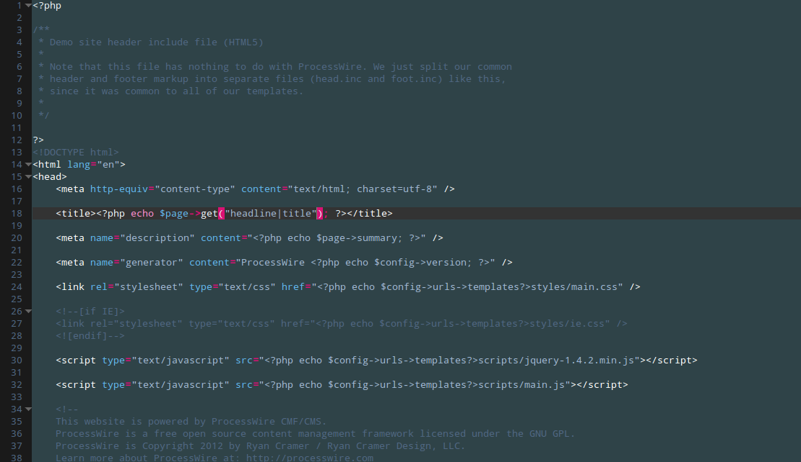

ProcessWire Texadept theme
==========================

theme for Textadept http://foicica.com/textadept/ inspired by the colors of ProcessWire http://processwire.com/

To install create a ~/.textadept/themes/ folder – if you don't have one already – and drop the theme inside it.

The theme uses Droid Sans Mono. Make sure you install the font also http://www.fontsquirrel.com/fonts/Droid-Sans-Mono

